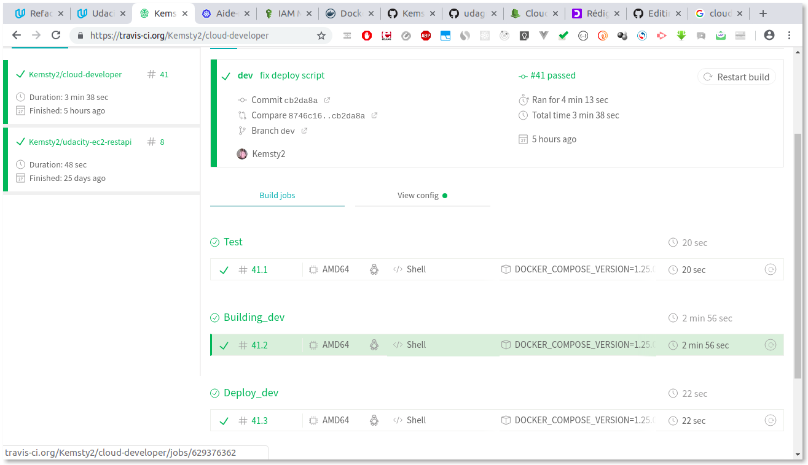
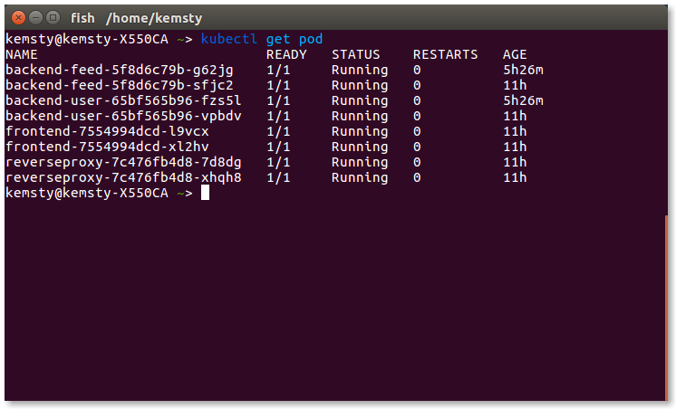
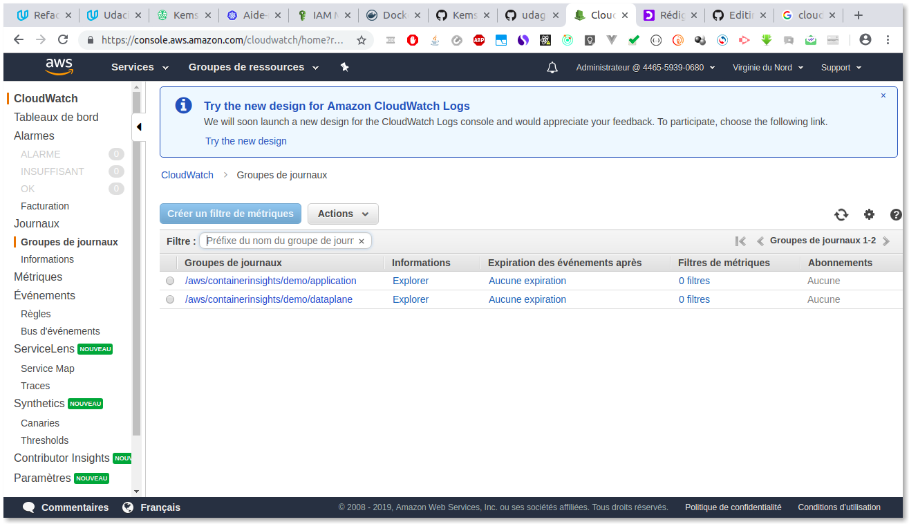
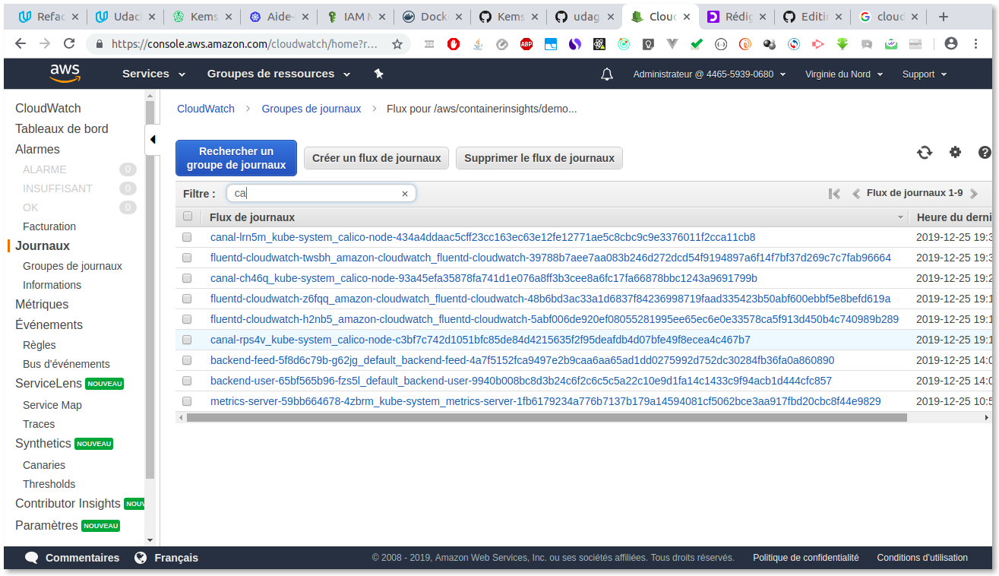
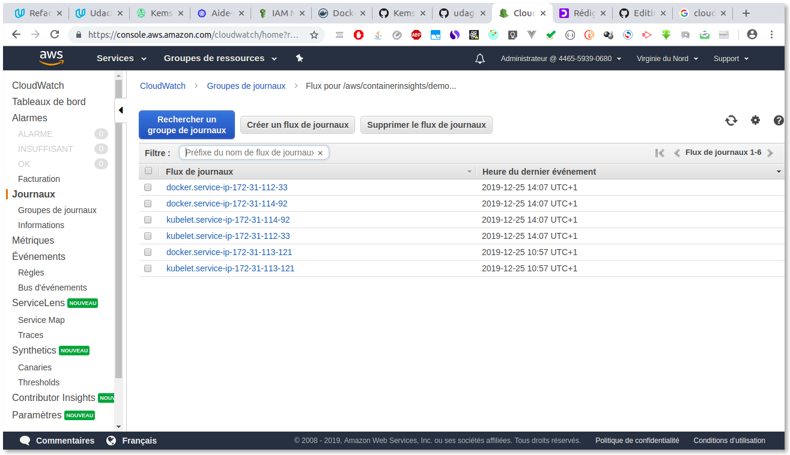
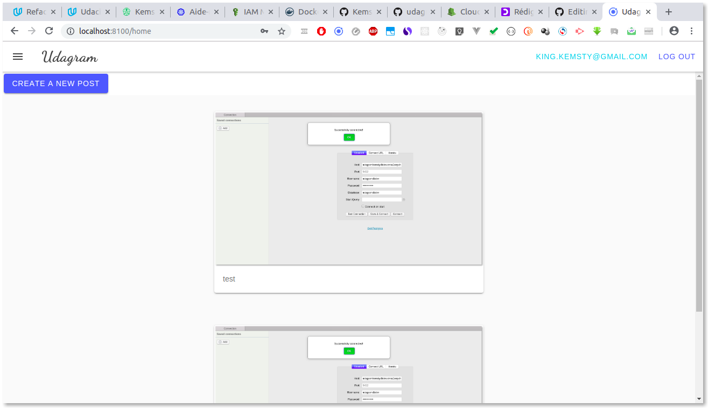

# Udagram Deployment Using Kubernetes and Docker-Compose

Udagram is a cloud based application build along the Cloud Developer For Enterprise NanoDegree. It allow user to :

- Sign in and Connect to a web based application.
- Post Picture with Caption to S3 Bucket
- Process Picture using Image Filtering build alongside

## Getting Started

### Dependencies

Cloud Service

- [Amazon Web Services S3](https://aws.amazon.com/fr/s3/) - Resource hosting and deployments
- [AWS RDS](https://aws.amazon.com/fr/rds/) - Relational Database
- [AWS CLI](https://aws.amazon.com/cli/) - AWS Command line interface
- [AWS IAM](https://aws.amazon.com/iam/) - AWS Identity Access Management Service

Performance Tool and DevOps Tools

- [AWS CloudWatch](https://aws.amazon.com/cloudwatch/) - Performance and Health checks
- [Travis (CI/CD)](https://travis-ci.org/) - Continious Integration and Continuous Development Tools

Kubernetes Lifecycle Management Tools

- [Kubeone](https://github.com/kubermatic/kubeone) - Lifecycle management tools for HA k8s Cluster

IaAs Tools

- [Terraform](https://www.terraform.io/) - Open Source IaAs Software Tools

Container Management Tools

- [Docker](https://docs.docker.com/get-started/) - Open Source container management tools
- [Docker-compose](https://docs.docker.com/compose/) - Open source container orchestration tools

### Prerequisites

To deploy this app on a cluster kubernetes, you need to have an :

- [Amazon Web Services](https://console.aws.amazon.com) account
- [DockerHub](https://hub.docker.com/) account

## Setup the project

### Clone the application

```bash
git clone https://github.com/Kemsty2/cloud-developer.git
```

### Create a S3 Bucket

After cloning the application, go to [here](https://console.aws.amazon.com/s3/home), to create S3 Bucket.  
.The application uses an S3 bucket to store the images so an AWS S3 Bucket needs to be created.
Follow the steps of this [article](https://docs.aws.amazon.com/quickstarts/latest/s3backup/step-1-create-bucket.html) to create the bucket.

#### Permissions

Save the following policy in the Bucket policy editor:

```JSON
{
 "Version": "2012-10-17",
 "Id": "Policy1565786082197",
 "Statement": [
 {
    "Sid": "Stmt1565786073670",
    "Effect": "Allow",
    "Principal": {
    "AWS": "__YOUR_USER_ARN__"
 },
 "Action": [
    "s3:GetObject",
    "s3:PutObject"
 ],
 "Resource": "__YOUR_BUCKET_ARN__/*"
 }
 ]
}
```
> NB: Modify the variables `__YOUR_USER_ARN__` and `__YOUR_BUCKET_ARN__` by your own data.

#### CORS Configuration

Save the following configuration in the CORS configuration Editor:

```XML
<?xml version="1.0" encoding="UTF-8"?>
 <CORSConfiguration xmlns="http://s3.amazonaws.com/doc/2006-03-01/">
 <CORSRule>
 <AllowedOrigin>*</AllowedOrigin>
 <AllowedMethod>GET</AllowedMethod>
 <AllowedMethod>POST</AllowedMethod>
 <AllowedMethod>DELETE</AllowedMethod>
 <AllowedMethod>PUT</AllowedMethod>
 <MaxAgeSeconds>3000</MaxAgeSeconds>
 <AllowedHeader>Authorization</AllowedHeader>
 <AllowedHeader>Content-Type</AllowedHeader>
 </CORSRule>
</CORSConfiguration>
```

### Create RDS Instance 
The application uses an RDS **Postgres** Instance to persist the data of the application. 
Follow the steps of this [article](https://aws.amazon.com/getting-started/tutorials/create-connect-postgresql-db/) to create a rds postgres database.

> NB : Make sure your rds database has public access


### Create Iam User 
For demo use you can use the administrator iam user. To create IAM user, follow the step of this [article](https://www.sweetprocess.com/procedures/5222/add-an-administrator-to-your-amazon-aws-account/). 

##  Deploy Udagram

### Setup Highly Available Kubernetes Cluster

#### Create the infrastructure using Terraform

1. Go to infrastructure folder
```bash
cd course-03/exercices/udacity-deployment/infrastructure
```
2. Run the command above to download additional plugin, for Terraform to handle aws provider
   ```bash
   terraform init
   ```
3. In the `infrastructure folder` modify the file and add your own paramater
   
    ```
    cluster_name = "demo"
    aws_region = "__YOUR_DEFAULT_AWS_REGION"
    worker_os = "ubuntu"
    ssh_public_key_file = "~/.ssh/id_rsa.pub"
    ```
4. Now that you configured Terraform you can use the  `plan` command to see what changes will be made:
   ```bash
   terraform apply
   ```    

5. Finally, if you agree with changes you can proceed and provision the infrastructure:

    ```bash
    terraform apply
    ```
    Shortly after you'll be asked to enter `yes` to confirm your intention to provision the infrastructure.  
    Infrastructure provisioning takes around 5 minutes.

#### Installing Kubernetes
1. Run the command above to create `config.yaml` file, which contains the reference configuration of `version 1.14.1` of Kubernetes. 
   ```bash
   kubeone config print > config.yaml
   ```
   Open the `config.yaml` file and remplace the version by `1.16.1`
   ```yaml
    apiVersion: kubeone.io/v1alpha1
    kind: KubeOneCluster
    versions:
        kubernetes: '1.16.1'
    cloudProvider:
        name: 'aws'
   ```
2. Installing Kubernetes by running this command
   ```bash
   kubeone install config.yaml --tfjson .
   ```
3. he installation process takes some time, usually 5-10 minutes. The output should look like the following one:

    ```
    time="11:59:19 UTC" level=info msg="Installing prerequisites…"
    time="11:59:20 UTC" level=info msg="Determine operating system…" node=157.230.114.40
    time="11:59:20 UTC" level=info msg="Determine operating system…" node=157.230.114.39
    time="11:59:20 UTC" level=info msg="Determine operating system…" node=157.230.114.42
    time="11:59:21 UTC" level=info msg="Determine hostname…" node=157.230.114.40
    time="11:59:21 UTC" level=info msg="Creating environment file…" node=157.230.114.40
    time="11:59:21 UTC" level=info msg="Installing kubeadm…" node=157.230.114.40 os=ubuntu
    time="11:59:21 UTC" level=info msg="Determine hostname…" node=157.230.114.39
    time="11:59:21 UTC" level=info msg="Creating environment file…" node=157.230.114.39
    time="11:59:21 UTC" level=info msg="Installing kubeadm…" node=157.230.114.39 os=ubuntu
    time="11:59:22 UTC" level=info msg="Determine hostname…" node=157.230.114.42
    time="11:59:22 UTC" level=info msg="Creating environment file…" node=157.230.114.42
    time="11:59:22 UTC" level=info msg="Installing kubeadm…" node=157.230.114.42 os=ubuntu
    time="11:59:59 UTC" level=info msg="Deploying configuration files…" node=157.230.114.39 os=ubuntu
    time="12:00:03 UTC" level=info msg="Deploying configuration files…" node=157.230.114.42 os=ubuntu
    time="12:00:04 UTC" level=info msg="Deploying configuration files…" node=157.230.114.40 os=ubuntu
    time="12:00:05 UTC" level=info msg="Generating kubeadm config file…"
    time="12:00:06 UTC" level=info msg="Configuring certs and etcd on first controller…"
    time="12:00:06 UTC" level=info msg="Ensuring Certificates…" node=157.230.114.39
    time="12:00:09 UTC" level=info msg="Generating PKI…"
    time="12:00:09 UTC" level=info msg="Running kubeadm…" node=157.230.114.39
    time="12:00:09 UTC" level=info msg="Downloading PKI files…" node=157.230.114.39
    time="12:00:10 UTC" level=info msg="Creating local backup…" node=157.230.114.39
    time="12:00:10 UTC" level=info msg="Deploying PKI…"
    time="12:00:10 UTC" level=info msg="Uploading files…" node=157.230.114.42
    time="12:00:10 UTC" level=info msg="Uploading files…" node=157.230.114.40
    time="12:00:13 UTC" level=info msg="Configuring certs and etcd on consecutive controller…"
    time="12:00:13 UTC" level=info msg="Ensuring Certificates…" node=157.230.114.40
    time="12:00:13 UTC" level=info msg="Ensuring Certificates…" node=157.230.114.42
    time="12:00:15 UTC" level=info msg="Initializing Kubernetes on leader…"
    time="12:00:15 UTC" level=info msg="Running kubeadm…" node=157.230.114.39
    time="12:01:47 UTC" level=info msg="Joining controlplane node…"
    time="12:03:01 UTC" level=info msg="Copying Kubeconfig to home directory…" node=157.230.114.39
    time="12:03:01 UTC" level=info msg="Copying Kubeconfig to home directory…" node=157.230.114.40
    time="12:03:01 UTC" level=info msg="Copying Kubeconfig to home directory…" node=157.230.114.42
    time="12:03:03 UTC" level=info msg="Building Kubernetes clientset…"
    time="12:03:04 UTC" level=info msg="Applying canal CNI plugin…"
    time="12:03:06 UTC" level=info msg="Installing machine-controller…"
    time="12:03:28 UTC" level=info msg="Installing machine-controller webhooks…"
    time="12:03:28 UTC" level=info msg="Waiting for machine-controller to come up…"
    time="12:04:08 UTC" level=info msg="Creating worker machines…"
    time="12:04:10 UTC" level=info msg="Skipping Ark deployment because no backup provider was configured."
    ```

    KubeOne automatically downloads the Kubeconfig file for the cluster. It's named
    as **\<cluster_name>-kubeconfig**, where **\<cluster_name>** is the name from
    your configuration. You can use it with kubectl such as

    Run the command above to copy the Kubeconfig file to your .kube folder.
    ```bash
    mkdir ~/.kube && cp demo-config ~/.kube/config
    ```


### Deploy the application 

#### Deploy the configmaps
1. Go to [`configMap folder`](https://..course-03/exercices/../../../course-03/exercises/udacity-deployment/k8s/configMap)
2. Open `env-configMap.yaml` and configure the file
   ```yaml
    apiVersion: v1
    kind: ConfigMap
    metadata:
        name: env-config
    data:
        AWS_BUCKET: {{AWS_BUCKET}}
        AWS_PROFILE: {{AWS_PROFILE}}
        AWS_REGION: {{AWS_REGION}}
        JWT_SECRET: {{JWT_SECRET}}
        POSTGRESS_DB: {{POSTGRESS_DB}}
        POSTGRESS_HOST: {{POSTGRESS_HOST}}
        URL: http://localhost:8100
   ```
3. After that run that comant to the deploy the configmap
   ```bash
   kubeclt apply -f env-configMap.yaml
   ```

#### Deploy the secret (env-secret)
1. Go to [`secrets folder`](https://..course-03/exercices/../../../course-03/exercises/udacity-deployment/k8s/secrets)
2. Open `env-secret.yaml` and configure the file
   ```yaml
    apiVersion: v1
    kind: Secret
    metadata:
        name: env-secret
    type: Opaque
    stringData:
        POSTGRESS_USERNAME: {{POSTGRESS_USERNAME}}
        POSTGRESS_PASSWORD: {{POSTGRESS_PASSWORD}}
   ```
   Remplace `POSTGRESS_USERNAME` and `POSTGRESS_PASSWORD` by string value
3. After that run that comant to the deploy the configmap
   ```bash
   kubeclt apply -f env-secret.yaml

#### Deploy the secret (aws-secret)
1. Go to [`secrets folder`](https://..course-03/exercices/../../../course-03/exercises/udacity-deployment/k8s/secrets)
2. Open `env-secret.yaml` and configure the file
   ```yaml
    apiVersion: v1
    kind: Secret
    metadata:
        name: aws-secret
    type: Opaque
    data:
        credentials: {{credentials}}
   ```
   Remplace `credential` by the value obtain after encode your aws credential file in base64. To do that run this command
   ```bash
   base64 ~/.aws/credentials
   ```
3. After that run that comant to the deploy the configmap
   ```bash
   kubeclt apply -f aws-secret.yaml

#### Deploy the rds postgres mysql service
1. Go to [`services folder`](https://..course-03/exercices/../../../course-03/exercises/udacity-deployment/k8s/services)
2. Open `rds-service.yaml` and configure the file
   ```yaml
    apiVersion: v1
    kind: Service
    metadata:
        name: mysql
    spec:
        type: ExternalName
        externalName: {{POSTGRESS_HOST}

   ```
   Remplace `POSTGRESS_HOST` by your POSTGRES RDS Database HOST.    
3. After that run that comant to the deploy the configmap
   ```bash
   kubeclt apply -f rds-service.yaml

#### Deploy run the app
Now on this step you will deploy udagram app on Kubernetes
1. Go to [`scripts folder`](https://..course-03/exercices/../../../course-03/exercises/udacity-deployment/scripts)
2. Run the script `./deploy_dev.sh`
   ```bash
   #!/bin/bash

    set -ev

    #   Create service object
    kubectl apply -f $PWD/course-03/exercises/udacity-deployment/k8s services/dev

    #   Create deployment object
    kubectl apply -f $PWD/course-03/exercises/udacity-deployment/k8s/deployments/dev

   ```
3. After that you can run that command to see the pod in state `runnnig`
   ```bash
   kubect get pod
   ```

#### Configure Cloudwatch agent 
To configure cloudwatch to monitore and logging the cluster follow this [article](https://docs.aws.amazon.com/AmazonCloudWatch/latest/monitoring/Container-Insights-setup-logs.html)


## Results

### Travis CI/CD


### Pod Running


### CloudWatch Logs




### Udagram Application


